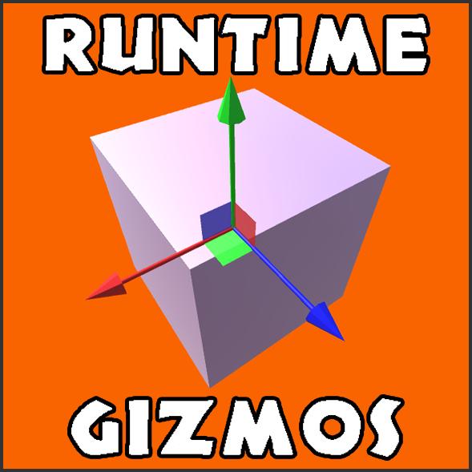

 
# Unity Runtime Gizmos
> 3D Manipulation Gizmos for final-build Unity projects.

Having recently had need to potter around in Unity for some work on data visualisation tools, I was disappointed to learn that not only
does Unity split their API into engine and editor sub-packages (where some of the useful editor functionality is not compilable for
runtime builds due to complexities with native code), but it also doesn't allow developers to incorporate the 3D gizmos that Unity's
scene view provides to facilitate translation, scaling, rotating, and snap movement of the camera.

A series of very simple 3D manipulation gizmos to emulate those found in the Unity Editor's scene view but accessible at runtime without
the use of the editor APIs.

Version 1.0 contains the following:
 - Translation Gizmo
 - Scaling Gizmo
 - Rotation Gizmo
 - View Gizmo
 - Associated materials, meshes, and example scenes for the above
 
 
## Usage
This asset package contains a series of four 3D manipulation gizmos allowing developers to provide translation, scaling, rotation, and view snapping to 
their end users in a final-build Unity project. To ensure that these gizmos can be interacted with and render correctly, a few instructions must be 
followed; these are listed below.

   -  A new layer should be created specifically for the use of these gizmos; in conjunction with a secondary 
  orthographic camera, this “Gizmo Layer” can be used to render the gizmos on top of any target game objects
  regardless of their position in 3D space.
  
  -  Once a prefab gizmo has been added to the scene (and set to the Gizmo Layer), its pre-attached script (or 
  the scripts attached to each of the handles within the prefab object) may contain variables that need to be
  populated. These are commonly the camera that it set to render the aforementioned Gizmo Layer and the 
  target game object to be rotated, scaled, translated etc.
  
  -  If required, the View Gizmo can be added to a UI canvas (also set to the Gizmo Layer) to ensure it remains
  in a set position and can be seen by the user at all times.
  
Different materials can be used to alter the appearance of any gizmo by applying the material to each gizmo handle, or its corresponding script if a new 
highlight material is desired.

Additionally, the functionality of each gizmo in contained in separate C# scripts within the Assets/Scripts folder. If changes in the behaviour of any gizmo 
are required, each script is fully commented and can be edited at will.

Any issues encountered, questions, or suggestions should be posted on the Unity Asset Store page of this package, or on the GitHub issues page on the 
repository at github.com/CaptainHillman/UnityGizmos/issues.

See the UsageInstructions.pdf file for more information on how to utilise the gizmos in your Unity project.

 
## Current Release 
See the 'master' branch for public releases within the 'Releases' folder.
 

## Branch Information
Current Git Branches: master, develop  
_Following [Vincent Driessen's model](http://nvie.com/posts/a-successful-git-branching-model/)_
  

## Licence

Copyright (c) 2016 - Michael Hillman under the MIT Licence  
_See [licence file](LICENSE) for more information_
